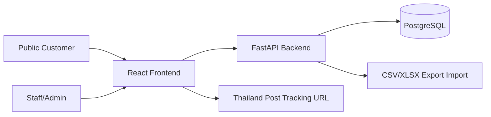
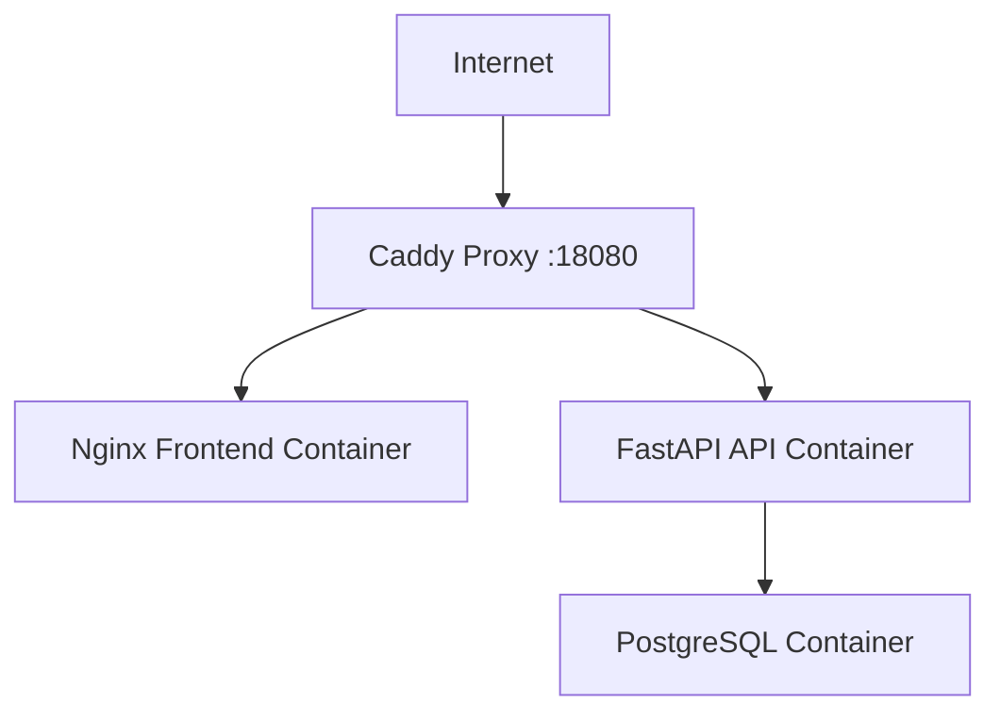
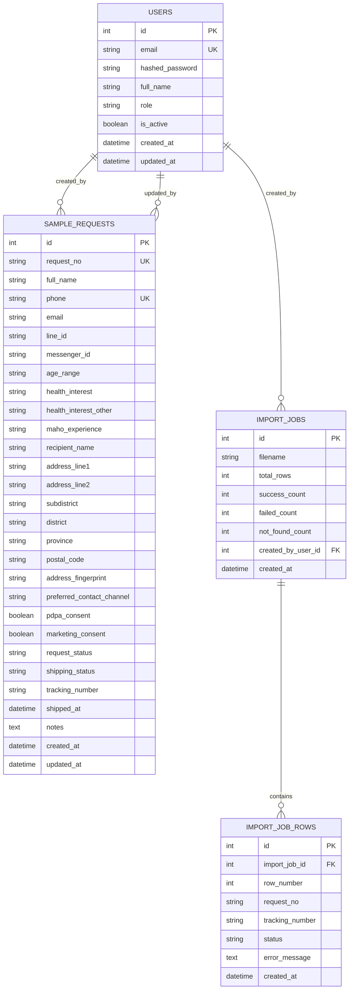

# Mahosample Architecture And Design

## 1. Architecture Overview

Mahosample ใช้ web application แบบแยก frontend/backend/database และ deploy ด้วย Docker Compose บน Hostinger VPS



## 2. Runtime Deployment



Production Docker resources:
- `mahosample-prod-proxy`
- `mahosample-prod-frontend`
- `mahosample-prod-api`
- `mahosample-prod-postgres`

ข้อควบคุมสำคัญ: deploy script ใช้เฉพาะ compose project ของ Mahosample และไม่แตะ Docker applications อื่นบน VPS

## 3. Main Components

| Component | Technology | Responsibility |
| --- | --- | --- |
| Public frontend | React, Vite, Tailwind | Registration form, success card, tracking page |
| Staff frontend | React, Vite, Tailwind | Dashboard, full table, filter/sort, export/import UI |
| Backend API | FastAPI, Pydantic, SQLAlchemy | Business rules, validation, authentication, CRUD, export/import |
| Database | PostgreSQL 15 | Store users, sample requests, import jobs |
| Proxy | Caddy | Route frontend/API traffic |
| CI | GitHub Actions | Backend tests and frontend build checks |

## 4. Data Model



## 5. Request Number Design

เลขรายการภายในใช้รูปแบบ:

```text
MSYYYYMMDDNNNN
```

ตัวอย่าง:

```text
MS202609020020
```

เหตุผล:
- อ่านง่าย
- บอกวันที่สร้างรายการได้
- ใช้เป็น key กลับจากไฟล์ export/import
- ไม่เปิดเผยข้อมูลส่วนตัว

## 6. Duplicate Detection

ระบบป้องกันการลงทะเบียนซ้ำด้วย 2 วิธี:

- เบอร์โทรศัพท์ซ้ำ: ตรวจจาก field `phone`
- ที่อยู่ซ้ำ: ตรวจจาก `address_fingerprint` ที่สร้างจากชื่อผู้รับและที่อยู่จัดส่ง

ผลลัพธ์ที่ API ส่งกลับ:

| Detail | Meaning |
| --- | --- |
| `duplicate_phone` | เบอร์โทรศัพท์ซ้ำ |
| `duplicate_address` | ที่อยู่จัดส่งซ้ำ |
| `duplicate_phone_and_address` | ซ้ำทั้งเบอร์และที่อยู่ |
| `duplicate_registration` | fallback จาก database constraint |

## 7. Status Design

Request status:
- `pending`
- `approved`
- `rejected`
- `packed`
- `shipped`
- `completed`
- `cancelled`

Shipping status:
- `not_ready`
- `ready_to_ship`
- `shipped`
- `delivered`
- `failed`

แยกสองสถานะเพื่อให้พนักงานเห็นทั้งสถานะคำขอและสถานะขนส่งอย่างอิสระ

## 8. Design Decisions

| Decision | Reason | Trade-off |
| --- | --- | --- |
| ใช้ React + FastAPI | ทำงานเร็ว แยก UI/API ชัดเจน | ต้องดูแลสอง runtime |
| ใช้ PostgreSQL | เหมาะกับข้อมูลธุรกรรมและ deploy production | ต้องมี database container |
| ใช้ CSV/XLSX import/export | เข้ากับ workflow ขนส่งที่ใช้ไฟล์ | ต้อง map column ให้ถูก |
| ใช้ JWT login | API stateless และง่ายต่อ frontend | ต้องดูแล secret/token expiry |
| ยังไม่เรียก Thailand Post API จริง | ลดความเสี่ยงและ dependency ในช่วงแรก | ยังไม่มี timeline real-time ในระบบ |
| แยกข้อมูลทดสอบด้วยสถานะ cancelled | เก็บหลักฐาน test และไม่ปนงานจริง | test records ยังอยู่ใน database |

